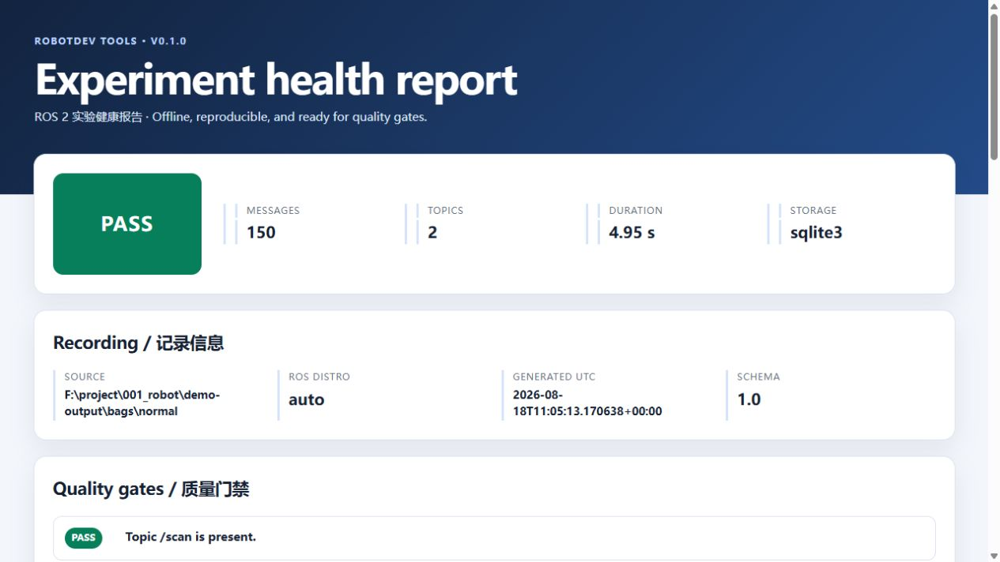

# RobotDev Tools

[中文](#中文) · [English](#english)



## 中文

RobotDev Tools 是一个面向机器人实验室的 **ROS 2 实验验收工具**。它直接读取
rosbag2（SQLite3 / MCAP），自动计算 Topic 健康度和里程计运动指标，并生成
PASS / WARN / FAIL 质量门禁结果、可离线分享的 HTML 报告以及 CI 可读取的 JSON。

它不是另一个 bag 播放器：核心目标是把“这次实验数据是否合格？”变成可复现的检查。
分析完全在本机进行，不上传数据，也不要求安装 ROS。

### 30 秒开始

要求 Python 3.10–3.13。

```bash
# 从 GitHub 安装（推荐使用 pipx 隔离环境）
pipx install git+https://github.com/1405264556/robotdev-tools.git

# 生成正常、低频和里程计跳变三个可重复示例
robotdev demo --output demo-output

# 分析自己的 rosbag2
robotdev analyze /path/to/rosbag2 \
  --config robotdev.yaml \
  --output report
```

Windows PowerShell：

```powershell
robotdev analyze "D:\实验数据\run 01" -c robotdev.yaml -o report
Start-Process report\report.html
```

也可以从 [GitHub Releases](https://github.com/1405264556/robotdev-tools/releases)
下载 wheel 后运行 `pipx install robotdev_tools-0.1.0-py3-none-any.whl`，或克隆源码后执行
`python -m pip install .`。

### 配置质量门禁

复制 [`examples/robotdev.yaml`](examples/robotdev.yaml)：

```yaml
version: 1
warn_margin_pct: 10

topics:
  /scan:
    required: true
    expected_rate_hz: 10
    rate_tolerance_pct: 10
    max_gap_ms: 250
    max_jitter_ms: 20

odometry:
  topic: /odom
  max_speed_mps: 1.5
  max_accel_mps2: 2.0
  max_position_jump_m: 0.5
```

- 突破硬阈值或缺少必需 Topic：`FAIL`，CLI 退出码为 `2`。
- 距离阈值不足 `warn_margin_pct`：`WARN`。
- 未提供配置：仍生成全部指标，但明确标记为 `NOT_EVALUATED`。
- 输入或配置错误：退出码为 `1`。

每次分析会生成：

```text
report/
├── report.html    # 自包含、无需服务器的可视化报告
└── summary.json   # schema_version=1.0 的机器可读结果
```

### v0.1.0 指标

所有 Topic：消息数、观测时长、平均/中位频率、周期抖动、最大间隔、断流数、
重复和倒退时间戳。

`nav_msgs/msg/Odometry`：XY 轨迹、累计里程、位移、平均/最大/P95 线速度与角速度、
最大加速度、位置跳变及阈值违规次数。

为控制大 bag 的内存占用，消息数、均值、标准差和最大值使用在线统计；图表和分位数
使用每个流最多 20,000 点的确定性蓄水池采样，并在报告中明确标注。

### Python API

```python
from robotdev_tools import analyze_bag
from robotdev_tools.report import write_report

result = analyze_bag("/path/to/bag", "robotdev.yaml")
write_report(result, "report")
print(result.status, result.to_dict())
```

### 当前限制和路线图

v0.1 聚焦 ROS 2 离线实验，不包含 GUI、云上传、AI 对话、PDF、ROS 1、ATE/RPE、
多次实验对比或实时节点监控。未知自定义消息无法反序列化时，仍会保留无需解码的
Topic 时间指标。

- v0.2：实验对比、基线回归、CSV 导出、CI 门禁模板。
- v0.3：SLAM/Nav2 插件、ATE/RPE、任务成功率和批量实验。
- 商业服务：实验室指标模板、报告定制、ROS 2 排障和私有 CI 集成。

欢迎实验室提交匿名化后的 `summary.json`、使用反馈或
[Issue](https://github.com/1405264556/robotdev-tools/issues)。请不要公开上传包含敏感信息的原始 bag。

## English

RobotDev Tools is a ROS-free experiment acceptance tool for robotics teams. It reads ROS 2
SQLite3 and MCAP bags, calculates topic timing and odometry health, evaluates reproducible
quality gates, and creates a self-contained HTML report plus compact JSON for CI.

```bash
pipx install git+https://github.com/1405264556/robotdev-tools.git
robotdev demo --output demo-output
robotdev analyze /path/to/rosbag2 --config examples/robotdev.yaml --output report
```

Use `robotdev analyze BAG` without a config for metrics-only mode. The result is intentionally
`NOT_EVALUATED` until explicit thresholds are supplied. Hard gate failures return exit code 2;
invalid input or configuration returns exit code 1.

Supported in v0.1.0:

- ROS 2 rosbag2 directories, raw `.db3`, and `.mcap` files.
- Python 3.10–3.13 on Windows and Linux (macOS is expected but not yet in CI).
- Per-topic frequency, jitter, gaps, and timestamp integrity.
- `nav_msgs/msg/Odometry` path, distance, velocity, acceleration, and jump checks.
- Bounded-memory sampling and local-only processing.

See [`examples/robotdev.yaml`](examples/robotdev.yaml) for the stable version-1 configuration.
Contributions are welcome; read [CONTRIBUTING.md](CONTRIBUTING.md) before sending a change.

## License

Apache License 2.0. See [LICENSE](LICENSE).
